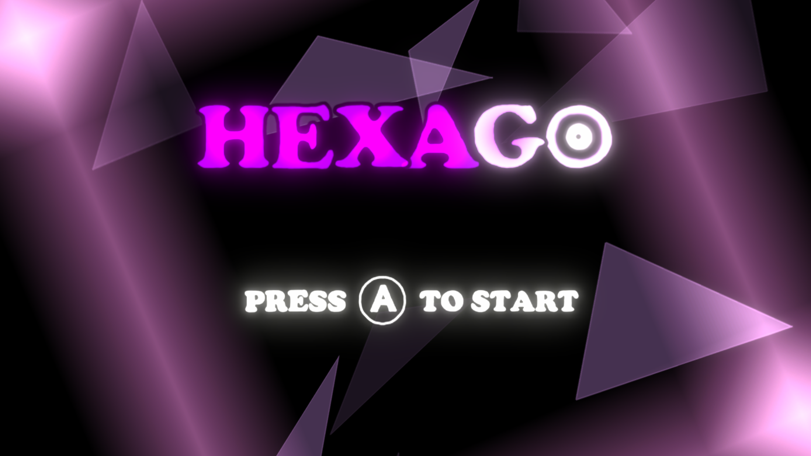
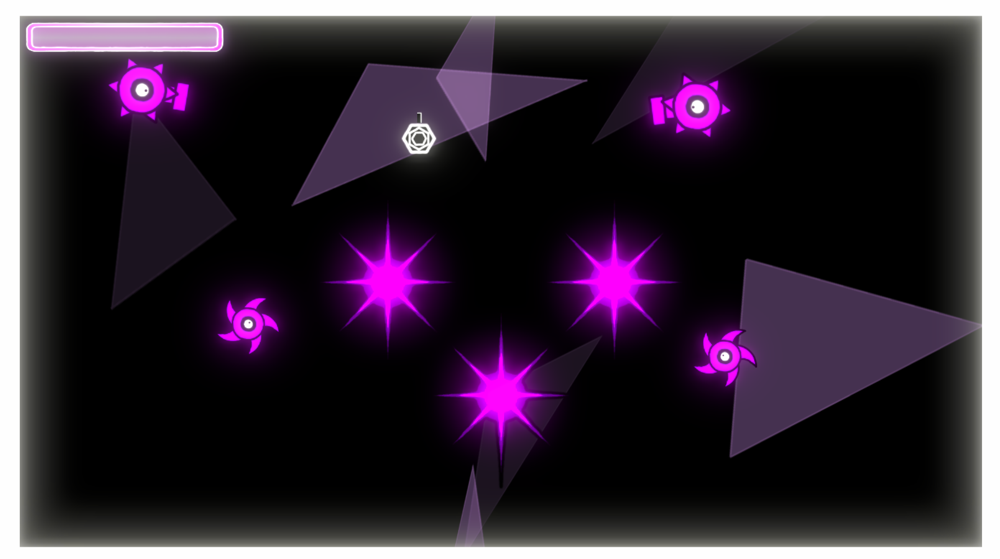
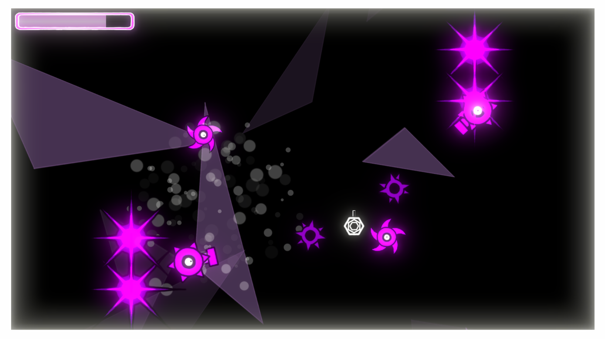
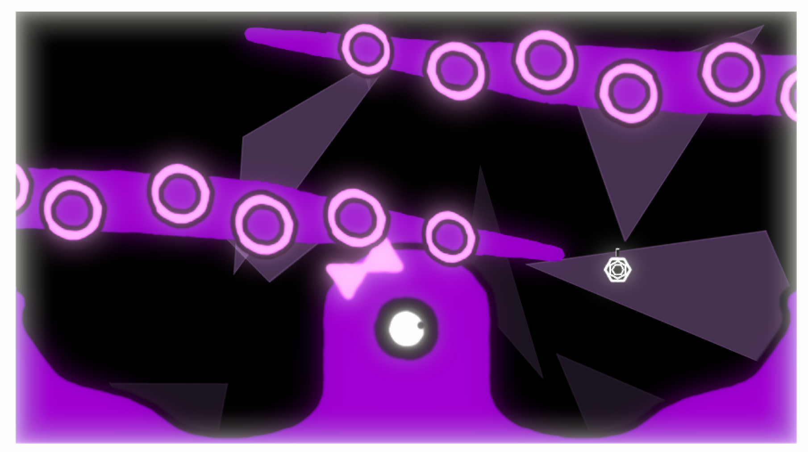

# HexaGo

Par PROB Bastien, HAJNAL Florian, MAGGAY Cédric

### Pitch

HexaGo est un jeu d'arcade aux composantes rogue-like. Vous devrez vous débarrassez de tous les ennemis sur votre chemin afin de débloquer de nouvelles armes et améliorations.

### Captures d'écran

<table>
	<tr>
		<td></td>
		<td></td>
	</tr>
	<tr>
		<td></td>
		<td></td>
	</tr>
</table>
